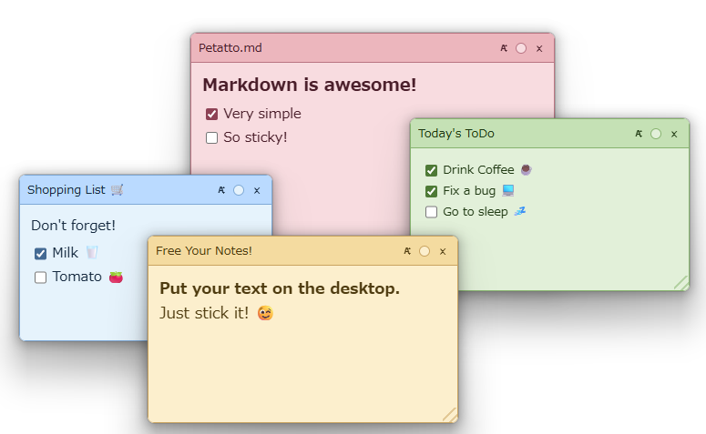
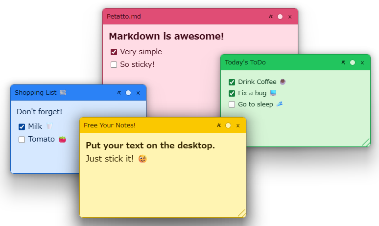
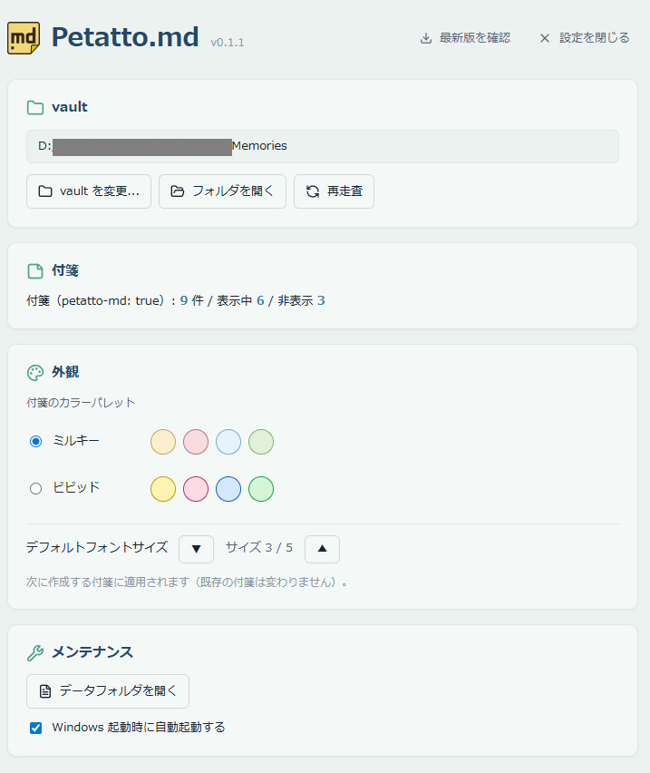
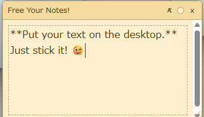
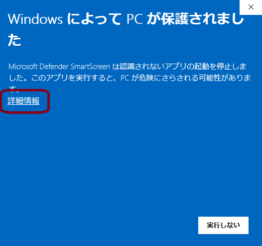
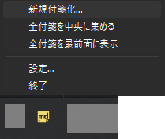

# Petatto.md

> **Language**: 日本語 / [English](README.en.md)

Obsidian vault 内の Markdown（.mdファイル） を、Windows デスクトップに**付箋として貼り付ける**デスクトップアプリ。

- 編集の主は **Obsidian**。Petatto.md は「眺める・チェックする」場所
- 付箋内での軽い編集（プレーンテキスト編集・チェックボックス切替）も可能
- TODO・進行中タスク・今見ておきたいメモをデスクトップに常駐させる用途

🌐 **製品紹介サイト**: <https://just2enough.github.io/petatto-md-site/>

## プライバシー

Petatto.md は **テレメトリ・使用状況データ・解析データを一切収集・送信・保存しません**。すべてのデータはあなたのマシン内にとどまります。

v0.1.1 から `tauri-plugin-updater` による更新確認機能を導入しています。これは「新しいバージョンがあるか」を `latest.json` に問い合わせるだけで、利用状況の送信は含みません。メインウィンドウ右上の「**最新版を確認**」ボタンを押したときにのみ通信し、起動時の自動チェックは行いません。

## スクリーンショット

**付箋（ミルキーパレット / ビビッドパレット、各 4 色循環）**




**メインウィンドウ**（vault 設定 / 外観 / メンテナンス）



**編集モード**



## 動作環境

- Windows 10 / 11（x64）
- [Microsoft Edge WebView2 ランタイム](https://developer.microsoft.com/microsoft-edge/webview2/)（Windows 11 と最近の Windows 10 にはプリインストール済。未インストール環境では MSI インストーラが Microsoft から自動 DL します。要ネット接続）
- [Obsidian](https://obsidian.md/)（必須ではないが、付箋化対象の md を作成・編集するのに想定している）

## インストール

1. リリース配布された `Petatto-md_x.x.x_x64_ja-JP.msi` をダウンロード
2. ダブルクリックでインストーラ起動
3. SmartScreen の警告画面（「**Windows によって PC が保護されました**」「Microsoft Defender SmartScreen は認識されないアプリの起動を停止しました」）が出るので、「**詳細情報**」→「**実行**」で続行。コード署名していないため発行元欄は「**不明な発行元**」と表示されますが想定通りです（自己責任の前提）

   
4. ウィザードに従ってインストール（既定で `C:\Program Files\Petatto-md\`）
5. スタートメニューから **Petatto.md** を起動（Apps & Features や Start メニューの表示は `Petatto-md`、起動後のウィンドウタイトルは `Petatto.md`）

### アンインストール

「アプリと機能」または「設定 → アプリ」から **Petatto-md** をアンインストール。
アンインストール後も DB・ログは残るため、完全に消したい場合は後述の「データ保存場所」のフォルダを手動削除。

## 初回起動と vault 設定

1. 起動するとメインウィンドウが開く（vault パス未設定の状態）
2. 「**vault フォルダを選ぶ**」ボタンを押し、Obsidian vault のルートフォルダを指定
3. 設定後、自動的に vault 内をスキャンし、frontmatter に `petatto-md: true` を持つ md があれば付箋として表示される

vault を変更したい場合は、メインウィンドウの **vault カード** から「**vault を変更...**」を押して再選択（再起動を促されます）。

## md を付箋にする

### 方法 1: トレイメニューから新規付箋化

タスクトレイの Petatto.md アイコンを右クリック → 「**新規付箋化...**」→ vault 内の md を選択。
選んだ md の frontmatter に `petatto-md: true` が自動で書き込まれます。



### 方法 2: frontmatter に直接書く（Obsidian 側）

対象の md ファイルの先頭に YAML frontmatter を追加:

```markdown
---
petatto-md: true
---

# 今週のタスク

- [ ] 月曜のミーティング資料を作る
- [x] 経費精算
- [ ] 〇〇さんに返信
```

保存すると Petatto.md 側で自動検知し、付箋がデスクトップに現れます。

### 付箋化の解除

付箋ヘッダの「**×**」ボタンを押す → frontmatter の `petatto-md: true` が削除され、付箋が消えます（ファイル自体は残ります）。

## 付箋の操作

| 操作 | 方法 |
|---|---|
| 移動 | ヘッダーをドラッグ |
| リサイズ | 付箋の四辺・四隅をドラッグ（最小 180×80px） |
| 色変更 | ヘッダーの色ボタン → 現在のパレットの色を順に巡回（ミルキー / ビビッド 各 4 色） |
| フォントサイズ変更 | ヘッダーの `A±` ボタン → ポップオーバー `▲ サイズ N/5 ▼` で 5 段階切替 |
| ファイル名変更 | ヘッダーのファイル名をダブルクリック → インライン編集（Enter 確定 / Esc キャンセル） |
| 編集モード突入 | 本文をダブルクリック |
| 編集モード抜け | 編集領域の外をクリック / `Esc` キー |
| チェックボックス切替 | `- [ ]` / `- [x]` をクリック |
| URL クリック | 本文中の http/https URL をクリック → 既定ブラウザで開く |
| 付箋を閉じる（= 付箋化解除） | ヘッダーの **×** ボタン |

### サポートする Markdown 要素

表示モードで描画される要素:

- 見出し（`#` 〜 `######`）
- リスト（`-` / `*` / 番号付き）
- チェックボックス（`- [ ]` / `- [x]`、クリックで切替可能）
- 強調（`**太字**` / `*斜体*` / `~~取消~~` / `__太字__` / `_斜体_` / `***太字斜体***`）
- リンク（`[text](url)`）+ 本文中の http/https URL（クリックで既定ブラウザに遷移）
- プレーンテキスト

**サポート外**の要素（画像 / コードブロック / テーブル / 引用 / 水平線 等）はプレーンテキストとして表示されます（クラッシュしません）。意図的に対応しない範囲は [やらないこと（Non-Goals）](non_goals.md) を参照。

## システムトレイ

タスクトレイの Petatto.md アイコン右クリックで以下のメニュー:

- **付箋一覧**（表示中 `●` / 非表示 `○`）: クリックで表示・非表示を切替
- **全付箋を中央に集める**: 迷子になった付箋をプライマリモニタ中央付近にカスケード状に再配置
- **全付箋を最前面に表示**: 表示中の全付箋を一時的に最前面に持ち上げる
- **新規付箋化...**: vault 内の md を選んで付箋化
- **設定...**: メインウィンドウを開く（vault 操作・外観・ログ採取はこちらから）
- **終了**: アプリ終了（全付箋がフェードアウトしてクローズ）

## データ保存場所

| 種類 | パス |
|---|---|
| 付箋の位置・サイズ・色・フォントサイズ（DB） | `%LOCALAPPDATA%\com.just2enough.petatto-md\petatto.sqlite` |
| ログ | `%LOCALAPPDATA%\com.just2enough.petatto-md\logs\petatto.log`（5MB × 5 世代ローテ） |

DB とログは同じ親フォルダに集約されています。メインウィンドウの「**データフォルダを開く**」ボタンでこの親フォルダを Explorer で開けます（バグレポート用、後述「トラブルシューティング・クラッシュ報告」を参照）。

vault 内の md には付箋固有の状態（位置・色など）は書き込みません。frontmatter の `petatto-md: true` フラグだけが「付箋化されているか」の真実です。

## トラブルシューティング・クラッシュ報告

Petatto.md は **クラッシュレポートの自動送信を行いません**（テレメトリ 0 方針）。代わりに、ローカルログをユーザが手動で採取して報告する運用です。

### ログ採取手順

1. メインウィンドウの「**データフォルダを開く**」ボタンを押す → Explorer で `%LOCALAPPDATA%\com.just2enough.petatto-md\` が開きます
2. 同フォルダ配下の `logs\petatto.log`（および直近の世代 `petatto.log.1` 等）をコピー
3. **個人情報の確認**: ログには vault 配下の md のファイル名・パスが含まれます。投稿前に必要に応じて編集・伏字化してください
4. 以下のいずれかで報告してください:
   - **note 記事のコメント欄**: https://note.com/just2enough/n/n0e7c73253b99
   - **GitHub Issue（バグ報告・ログ添付向け）**: https://github.com/Just2enough/petatto-md-releases/issues

### よくある問題

- **付箋が表示されない**: vault が正しく設定されているか確認（メインウィンドウ → vault カード）。`petatto-md: true` の frontmatter があるか確認
- **付箋が画面外に行ってしまった**: トレイの「全付箋を中央に集める」または「全付箋を最前面に表示」で回収
- **vault 変更後に古い付箋が残る**: アプリを再起動（メインウィンドウから促されます）
- **SmartScreen 警告**: MSI を初回ダブルクリックすると「**Windows によって PC が保護されました**」画面が出ます。「**詳細情報**」→「**実行**」で続行できます（コード署名していないため、発行元欄は「**不明な発行元**」と表示されます。自己責任の前提）

## ライセンス

Copyright © 2026 Just2enough. All rights reserved.

Petatto.md は **個人・組織内のいずれの利用でも無料** です。再配布・改変・リバースエンジニアリング等は禁止されています。

詳細は同梱の [LICENSE](LICENSE) を参照してください。

本ソフトウェアは多くのオープンソースソフトウェアの上に成り立っています。利用している各コンポーネントとそのライセンス全文は、同梱の [THIRD-PARTY-NOTICES.txt](THIRD-PARTY-NOTICES.txt) を参照してください。

## 開発を応援する ☕

このツールがお役に立ったら、開発の継続を応援していただけると嬉しいです。

<a href="https://github.com/sponsors/Just2enough">
  
</a>
<a href="https://www.buymeacoffee.com/just2enough">
  
</a>
